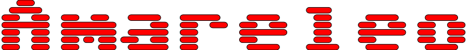

# Amareleo

...for those in love with Leo

Welcome to Amareleo, an open-source toolset for Leo developers.

Amareleo today is a wrapper for the [amareleo-chain](https://github.com/kaxxa123/amareleo-chain) node, tomorrow it will become a feature-rich test framework.