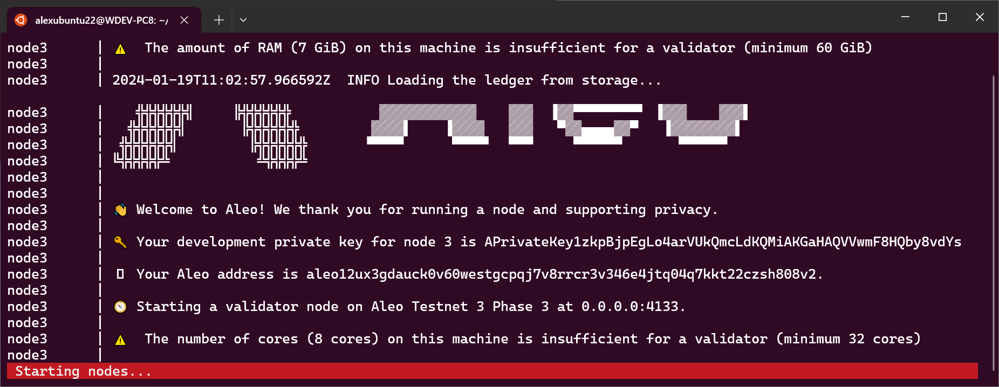

# Amareleo-Chain - disposable, developer friendly, Aleo chain instances.

## What is Amareleo-Chain?

* A process manager that launches multiple snarkOS instances and cleans up the ledger storage on exit.

* Relieves developers from the details or running multiple snarkOS instances to have a functioning test environment.


<BR />

## Install

Amareleo-chain was tested against the latest snarkOS release to date (v2.2.7) on __Ubuntu 22.04 (LTS)__.


* [Check the minimum requirements for running snarkOS](https://github.com/AleoHQ/snarkOS?tab=readme-ov-file#2-build-guide).

* Install the latest snarkOS
    ```BASH
    git clone https://github.com/AleoHQ/snarkOS.git
    cd snarkOS
    git checkout testnet3
    cargo install --path .
    ```

* Install amareleo-chain
    ```BASH
    git clone git@github.com:kaxxa123/amareleo.git
    cd amareleo/amareleo-chain
    cargo install --path .
    ```

<BR />


## Run

If everything is correctly installed launch an Aleo developer chain:

```BASH
amareleo-chain
```



Wait until all four nodes are started. Next you can peak into the logs of each node by entering the node number (0 to 3) or simply let it run and go test your leo programs. Afterall that is the main purpose of amareleo-chain.

Once ready hit q to terminate amareleo-chain.

<BR />

## What Next?

There is more we would like to add. We want to tool to be fully configurable such that if snarkOS changes one would get the tool running by tweaking a JSON configuration file. We also want the tool to start showing critical information like the processing of transactions and the mining of new blocks whilst filtering out other information. Stay tuned and post an issue if you would like to add more functionality.
